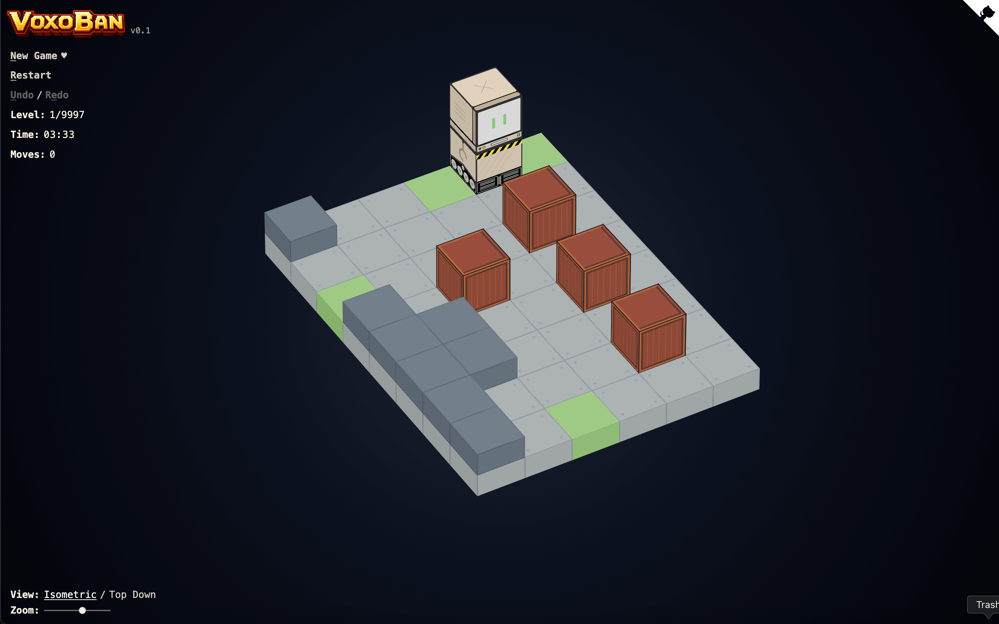

# Voxoban

Voxoban is a browser-based 3D CSS Sokoban puzzle game that renders voxel-style
boards as real HTML/CSS 3D geometry through [VoxCSS](https://github.com/LayoutitStudio/voxcss),
without a WebGL or canvas renderer. It packs a curated subset of Boxoban levels
into TypeScript, runs Sokoban movement rules in the browser, and ships as a
static Nuxt app.

Play the live version: [voxoban.com](https://voxoban.com)



## How to Play

Install dependencies and run the local dev server:

```sh
npm install
npm run dev
```

For production checks:

```sh
npm run check
npm run generate
npm run audit
```

`npm run check` validates packed level data, runs unit tests, and builds the
Nuxt app. `npm run generate` writes static output to the ignored `dist/` folder.

## How It Works

Voxoban uses VoxCSS for DOM-based 3D rendering. Floors, walls, crates, goals,
and the player are projected into real DOM elements positioned in 3D with CSS
transforms and textured from the bundled PNG/SVG assets in `public/`.

`src/game/rules.ts` owns the Sokoban rules: movement, crate pushes, goal checks,
and level completion. `src/game/deadlocks.ts` catches simple unwinnable crate
placements so the player gets immediate feedback when a move traps the board.

`src/levels/source/` contains the tracked curated level text files.
`scripts/pack-boxoban.mjs` packs those text files into
`src/levels/packed-levels.ts`, and `scripts/validate-packed-levels.mjs` verifies
the packed bundle used by the app.

## Build and Runtime

The browser does not fetch the upstream Boxoban mirror at runtime. The app
imports the generated packed level bundle from `src/levels/packed-levels.ts`
and uses the static texture assets committed under `public/`.

The full upstream Boxoban mirror is intentionally ignored by Git because it is
large. Keep it locally at `data/boxoban-levels-master/` only when rebuilding or
auditing source data.

Rebuild the packed bundle after editing tracked level text files:

```sh
npm run pack:levels
```

## License

Voxoban source code is [ISC](LICENSE). Bundled puzzle levels are derived from
DeepMind's Boxoban dataset under Apache License 2.0; see [LICENSE](LICENSE) for
attribution and citation details.
